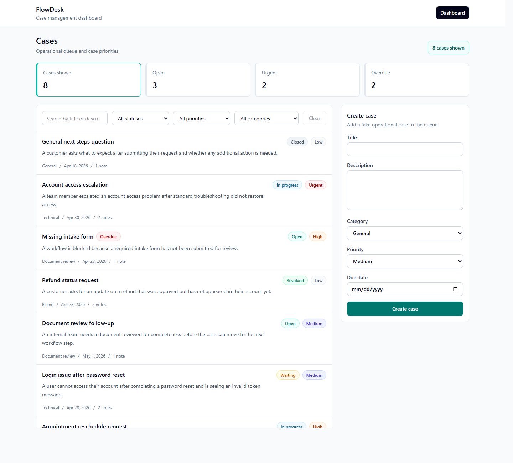
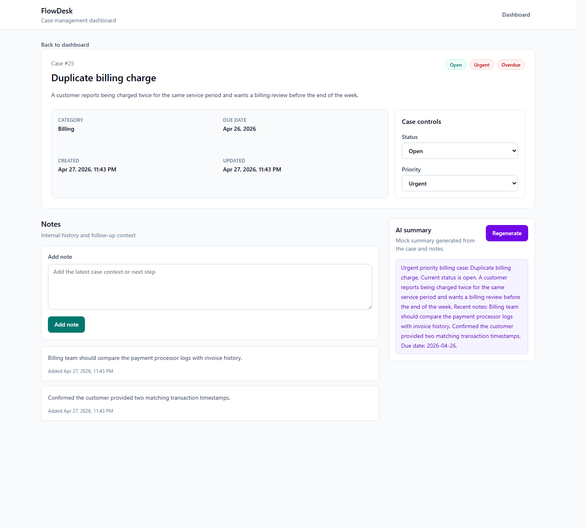

# FlowDesk

FlowDesk is an AI-assisted case management dashboard for tracking operational cases, priorities, notes, due dates, and summaries.

The project is designed as a realistic full-stack portfolio app using a React frontend and a Django REST Framework backend. It uses fake operational cases only; no real health, customer, or sensitive data should be used.

## Screenshots

### Dashboard



### Case Detail With Mock AI Summary



## Features

- Create, view, update, and manage cases
- Filter cases by status, priority, and category
- Search cases by title or description
- Track due dates and overdue cases
- Add internal notes to cases
- Generate mock AI-style case summaries
- Seed fake demo data for local development
- REST API built with Django REST Framework
- React frontend with TypeScript
- Backend tests with pytest

## Current Progress

- Backend case and note API is implemented
- Local fake case seed data is available
- Frontend app shell and routing are implemented
- Dashboard can load, search, filter, and create cases
- Case detail page can load cases, update status/priority, and add notes
- Mock AI summaries can be generated from case details and notes
- Backend tests cover core case workflows

## Tech Stack

Frontend:

- React
- TypeScript
- Vite
- Tailwind CSS
- React Router
- Axios

Backend:

- Python
- Django
- Django REST Framework
- SQLite for local development
- PostgreSQL planned for deployment
- pytest
- pytest-django

## Architecture

```text
React + TypeScript frontend
  |
  | HTTP requests with Axios
  v
Django REST Framework API
  |
  | Django ORM
  v
SQLite local database
```

The mock AI summary is intentionally implemented on the backend through a small service helper. That keeps the endpoint stable and makes it easier to replace the mock logic with a real AI provider later.

## Project Structure

```text
FlowDesk/
  backend/
    cases/
    config/
    manage.py
    requirements.txt
  frontend/
    src/
      api/
      components/
      pages/
      types/
  docs/
  screenshots/
  plan.md
  roadmap.md
  README.md
```

## API Routes

Base URL:

```text
http://127.0.0.1:8000/api/
```

Case endpoints:

```http
GET /api/cases/
POST /api/cases/
GET /api/cases/{id}/
PATCH /api/cases/{id}/
DELETE /api/cases/{id}/
POST /api/cases/{id}/generate_summary/
```

Note endpoints:

```http
GET /api/notes/
POST /api/notes/
GET /api/notes/{id}/
PATCH /api/notes/{id}/
DELETE /api/notes/{id}/
```

Case filters:

```http
GET /api/cases/?status=open
GET /api/cases/?priority=urgent
GET /api/cases/?category=billing
GET /api/cases/?search=refund
```

## Local Setup

### Backend

From the repo root:

```powershell
Set-Location backend
python -m venv venv
.\venv\Scripts\python.exe -m pip install --upgrade pip
.\venv\Scripts\python.exe -m pip install -r requirements.txt
.\venv\Scripts\python.exe manage.py migrate
.\venv\Scripts\python.exe manage.py seed_cases
.\venv\Scripts\python.exe manage.py runserver
```

Backend URL:

```text
http://127.0.0.1:8000/
```

Admin login page:

```text
http://127.0.0.1:8000/admin/login/
```

### Frontend

From the repo root in a second terminal:

```powershell
Set-Location frontend
npm install
npm run dev
```

Frontend URL:

```text
http://127.0.0.1:5173/
```

Frontend environment:

```text
VITE_API_BASE_URL=http://127.0.0.1:8000/api
```

## Sample Data

The backend includes a local development seed command that creates fake operational cases and notes:

```powershell
Set-Location backend
.\venv\Scripts\python.exe manage.py seed_cases
```

To reset existing local cases before seeding:

```powershell
.\venv\Scripts\python.exe manage.py seed_cases --clear
```

The seed data is intentionally fake and should not contain real health, customer, or sensitive information.

## Running Tests

Backend tests:

```powershell
Set-Location backend
.\venv\Scripts\python.exe -m pytest
.\venv\Scripts\python.exe manage.py check
.\venv\Scripts\python.exe manage.py makemigrations --check --dry-run
```

Frontend checks:

```powershell
Set-Location frontend
npm run lint
npm run build
```

## Build Roadmap

The project is being built in parts so each step leaves the app in a working state.

See [roadmap.md](roadmap.md) for the active execution checklist.

See [plan.md](plan.md) for the full product plan and project rationale.

## Resume Notes

See [docs/resume.md](docs/resume.md) for resume bullets, a short project pitch, and interview talking points.

## Deployment

Not deployed yet.

Planned deployment path:

- Frontend on Vercel, Netlify, or Render static hosting
- Backend on Render, Railway, or Fly.io
- PostgreSQL for production data
- Environment-based settings for `DEBUG`, `ALLOWED_HOSTS`, CORS, and database configuration

## What I Learned

- Designing a small but realistic case management data model
- Building RESTful CRUD endpoints with Django REST Framework
- Keeping API filtering and search simple enough for a first MVP
- Connecting a React dashboard to real backend data
- Handling loading, error, and empty states
- Using a mock AI workflow without blocking on external API keys
- Adding focused backend tests for high-value behavior

## Future Improvements

- Add authentication with JWT
- Add user-specific case assignment
- Add PostgreSQL deployment
- Replace the mock summary with a real AI provider
- Add frontend tests with React Testing Library
- Add API documentation with an OpenAPI schema
- Add dashboard sorting and simple metrics
- Add a live demo link after deployment
